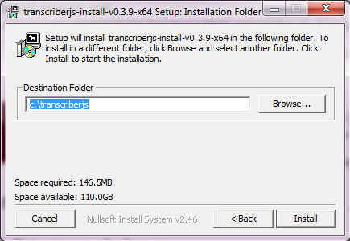
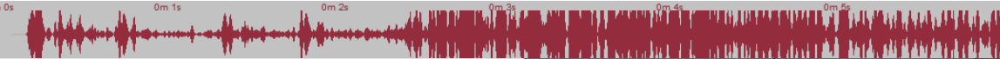

<header> ** T R J S ** 0.7.5 - Documentation : **First steps**</header>

[  
Install](#install)[  
Main features](#features)[  
Open a transcript](#opentrs)[  
Open a media](#media)[  
Basic editing](#editing)[  
Transcription commands](#transcribing)[  
Keyboard features](#keyboard)[  
Parameters and other features](#parameters)

# Install TRJS

* * *

## Conditions for installation

1.  Mac OS :

*   **minimum version 10.9** (Mavericks)
*   and more recent ones
*   for older version, install version 0.4.9

3.  Windows :

*   Seven
*   8
*   10

5.  Other systems :

*   Linux: Installation is done with the sources.

Installation programs can be downloaded here [Téléchargement](http://ct3.ortolang.fr/trjs/doku.php?id=start).

## Under Windows

1.  Click on [download link](http://ct3.ortolang.fr/trjs/doku.php).  
    Select the appropriate Windows version.  
    You can **download this file**.
2.  In the **download** directory, and you will find a file named **trjs-....exe** according to the version downloaded.  
    You have to open it to start the installation.  
    On Windows 10, a red window appears that warns against the use of dangerous programs. You have to select in the bottom right the message "More information" to obtain a screen where you can confirm that you want to use the installation program.  
    The following window appears:  We suggest to keep selected the **Desktop Shortcuts** so that it will be possible to start TRJS from the Desktop using a shortcut.  The default directory is **trjs** in "Program Files ..."  
    You can choose any other location.
3.  The installation of TRJS is **finished**. You can close the installation program.

## Under MacOS

The download is a zipped file. If you click on this file, it will be automatically unzipped. The result is an app file (TRJS.app), that you can move into any other location, including the Applications folder.  
_For the first use of the software, use **control+right click** to start the program, instead of right click. This will allow you to confirm that the software is secure and can be used on your computer._

## Other systems

For Linux systems, it is necessary to install starting from the sources. Installation from the sources requires the previous installation of Node.js, NPM, Java, FFMPEG and FFPASTE.  
Node.js and NPM are necessary to get the sources and compile the program. The other libraries are necessary for file import/export and for wave visualisation and media conversion. Some system libraries have to be added, if not present already: sudo apt-get install libxext-dev libxtst-dev libxkbfile-dev  
All this can be done with the following commands:

<pre>        sudo apt-get update
        sudo apt-get install openjdk-8-jre
        sudo apt-get install nodejs npm
        sudo apt-get install libxext-dev libxtst-dev libxkbfile-dev
        sudo apt-get install ffmpeg
        </pre>

Sources are available here: http://www.github.com/christopheparisse/trjs/ or download the file called "trjs-version-NUMBER.zip". (NUMBER is the version name, for example, 0.7.4). Or use git clone.

<pre>         git clone http://www.github.com/christopheparisse/trjs.git
        </pre>

Once the downloaded files are unzipped or after using git clone with github, please do:

<pre>        npm install
        npm run gulp
        npm run electron
        </pre>

To use the lexical checker it is necessary to run at least once:

<pre>npm run rebuild</pre>

To run the software once install, it is only necessary to use:

<pre>        npm run electron
        </pre>

Starting the command sh buildlinux.sh will create a folder named release which contains a folder nammed Trjs-linux-x64  
. This folder can be move and renammed. It contains the executable file and all parameters. It is only necessary to start the "Trjs" file in this folder to start TRJS. If Trjs-linux-x64 is moved, the source folder can be removed. Or it can be kept for updating the software. To do this, change git clone for git pull origin and repeat the whole process.

# Main features of TRJS

* * *

## Start TRJS

Please double-click on the icon of the program.

It is possible to associate a file extension to the software so it can be started from the finder with specific file types. Possible files types are .trjs, .xml, and any file type that can be automatically converted by TRJS (chat files, text files, elan files, praat files, transcriber files, subtitle files). The use of .trjs is suggested so that it does not create confusion with other file types.

## Layout of the TRJS window

Once TRJS is started, it opens the main window.  
This window contains several main parts, which are divided into:  
  

1.  The [menu bar](#menubar) (top of the screen for the Max, with access to parameters and functionalities.
2.  The [media field](#mediafield), surrounded by optional [toolbars](#toolbars) for editing the transcription.
3.  The [signal](#signal), sound representation of the media.
4.  The [partition](#partition), horizontal representation of the transcription.
5.  The [media commands](#commands), playing buttons and time code setting.
6.  The [transcription](#transcription), where it is possible to edit the text.
7.  Set of [toolboxes](#toolbars) for quick access.

## The menubar

The menubar contains several submenus, each with a list of functions:  

The _file menu_ which contains several options to open, save, import and export the file.  
The _edition menu_ which contains the main function for editing a line of text, using macros, for copy and paste, for switching to line mode editing, and using voice recognition (for MacOS) to insert text with your voice.  
The _tools menu_ which provide access to serch and replace functions, to tier and metadata edition, to macro edition, to parameters selection, to transcription checking, to time links modification on the whole file, to media conversion.  
The _view menu_ allow to go to full screen mode, to zoom out or to zoom in, to display or not the toolboxes.  
The _help menu_ contains various informations about using the software, but also accès to keyboard actions and modification and to display the information messages.  

## Media part

The media field contains video and/or audio.

  

The reading bar is specific to the media (video or audio), it appears when the cursor is above the video and disappears after three seconds when playing the video.  
There are the following options:

1.  Go backwards (3 seconds by default : can be changed in the menu _PARAMETRES_ ) ou keyboard shorcut: **Alt ←**
2.  Playing media/pause
3.  Horizontal **displacement** bar in the media, with **position** indicator in _hh:mm:ss_
4.  Display of exact media time
5.  Volume (mute option)
6.  Full screen or keyboard shorcut: **ESC** to go back to normal view
7.  Go forwards or keyboard shortcut: **Alt →**

The video field can be resized with keyboard shortcuts: Alt+F2 makes it smaller, Alt+F3 makes it larger

## Wave

The intensity wave is a visual representation of the sound according to time and intensity.

  

## Music score

The music score is an horizontal representation of the (vertical) transcription (the text) which provide a clear visual representation of the overlaps between two or more speakers. The screen correspond to a music score page. The extend of the page can be adjusted by the music score zoom commands.

  

## Media commands

The buttons presented around the media field (audio or video) are also associated with keyboard shorcuts.

  

When the cursor is moved above an icon, a small **information text** appears and describes the function of the command, and also indicates the corresponding shortcut.

<table>

<tbody>

<tr>

<th>Icon</th>

<th>Keyboard shortcut</th>

<th>Function</th>

</tr>

<tr>

<td></td>

<td></td>

<td>**Play/Pause**: playing the media (starting from where the media is stopped or where the cursor is in the text)  
/!\ This function does not move the position within the text.</td>

</tr>

<tr>

<td></td>

<td></td>

<td>**Set start**: insertion of the current time at the **start** of the current transcription line (where the insertion point is in the transcript)</td>

</tr>

<tr>

<td></td>

<td></td>

<td>**Set end**: insertion of the current time at the **end** of the current transcription line (where the insertion point is in the transcript)</td>

</tr>

<tr>

<td></td>

<td></td>

<td>**Insert**: insert a new empty line for a new speaker in the transcription (below the secondary lines)</td>

</tr>

<tr>

<td></td>

<td></td>

<td>**Repeat**: plays the current line (where the insertion point is in the transcription)</td>

</tr>

<tr>

<td></td>

<td></td>

<td>**Go continuous**: plays the text continuously, jumping from one line to another (starting from where the insertion point is in the transcription)</td>

</tr>

<tr>

<td></td>

<td></td>

<td>**Backward**: goes backwards (one music score page)</td>

</tr>

<tr>

<td></td>

<td></td>

<td>**Forward**: goes forwards</td>

</tr>

<tr>

<td> </td>

<td></td>

<td>**Music score zoom**: These commands make the contents in the music score larger or smaller. This changes the amount of time represented in one music score (horizontal) page.</td>

</tr>

</tbody>

</table>

## Transcription

[See below](#h2struct)

## Toolbars

  

The tool bars provide easy access to the main function of TRJS.  
Each icon is also associated to a keyboard shortcut, which is displayed as a tooltip when the cursor hover above the icon.

# Open a transcription and a media

## Open a transcription

* * *

### Create a new transcription

In the menu _FILES_, select **New transcript**.

A window will open to ask you to choose the media associated with your transcription. You can choose a media or cancel to work without media. Then you can begin the transcription.

The transcription can now be edited in the bottom part of the window as indicated here.

  

### Open an existing transcription

In the menu _FILES_, select **Open a transcript**.

If the transcription is associated with a media file, the media file will be loaded automatically. The media file does not have to be in the same location as the transcription. If the transcription does not have any media file, as shown here.

  

Or if you want to change the media.  
Follow the instructions below "Read a media".

## Read a media

* * *

### Load a media

In the menu _FILES_, select **Choose a media**. If there is problem with the media, then it is loaded and visible.  
In case of problem, for example compatibility format, it can be necessary to convert the media.

## Using the media

### Reading functions

Several functions and keyboard shortcuts are avalaible, each with its functionnalities and specificities:

<table>

<tbody>

<tr>

<th>Icon or keyboard shortcut</th>

<th>Fonctionnality</th>

<th>Description</th>

</tr>

<tr>

<td>TAB</td>

<td>Playing or pausing the media.</td>

<td>Playing starts from the current point or starts from the beginning of the current line if the media is out of the bounds of the current line. Playing remains around the transcription.</td>

</tr>

<tr>

<td>Shift + TAB</td>

<td>Playing or pausing the media from the start of the line. Similar as F7, but does not stop at the end.</td>

<td></td>

</tr>

<tr>

<td>Alt + TAB</td>

<td>Playing or pausing the media.</td>

<td>Plays the media from where it is stopped, independantly from the transcription</td>

</tr>

<tr>

<td>F7</td>

<td>Reads the current line from start to end</td>

<td>_read one line only_</td>

</tr>

<tr>

<td>Alt F7</td>

<td>Reads three lines around the current line</td>

<td>_plays the context of the current line_</td>

</tr>

<tr>

<td>F8</td>

<td>Continuous reading, following the transcription</td>

<td>Playing starts from the current point or starts from the beginning of the current line if the media is out of the bounds of the current line</td>

</tr>

</tbody>

</table>

# Editing the transcription

* * *

## Structure of the transcription

The transcription is presented in a vertical succession of horizontal blocs as in a text. Each horizontal bloc corresponds to the description of speech and actions by one speaker. Each bloc is made of four parts:

1.  The name of the speakers (this can be presented either by their code or role, or by the name)
2.  The starting time of the bloc (optional: can be empty)
3.  The ending time of the bloc (optional: can be empty)

*   A clic with the mouse on the time makes it possible to edit them in seconds and milliseconds.
*   The number of digits on the left side of the number can be set from 0 to 3 in the parameter section

5.  The transcription content

The blocs can correspond to main lines. These are the topmost lines in the organisation of a transcription. Most often, these lines contains the orthographic transcription of what was say. This is not always true and possible, for example when coding a language without written form such as an signed language or a language of oral tradition. For these cases, any type of information can be used such as API or any type of Unicode font.  
The vertical navigation bar is located at the right of the transcription.

  

*   The shades of grey on the lines corresponds to speakers. The are three levels of grey. The dark grey is for the most frequent speaker. The middle grey is for the second most frequent speaker. The light grey s for the other speakers.
*   The selected line is in yellow and underlined in blue when in edition mode. Dependant lines are in light yellow.

Putting the cursor on a line will select the corresponding part in the music score. Conversly, selecting the music score will select the corresponding line.  
Selecting a line or the music score will select the corresponding wave position. However, selecting the wave position does not changed the position of the music score or the transcription.

## Fast transcribing and fast linking edition

Put the cursor on a locutor line. If this line does not containt any starting time mark, use the media to choose the desired starting time and then hit F4, this will set the starting time.You can also edit directly the starting time in the first column after the speaker name.  
<u>From this time on, the TAB kay will start or stop the sound or the video</u>. The keys ALT+left arrow and ALT+right arrow make it possible to move forward or backward the media. <u>The transcription can be written in real time</u>, at the same time the media is played or not. When a transcription line is finished, hit the RETURN key when the media will play the end of the line (or after stoping the media at that exact time). The end time will be marked on the second time column, the cursor will go to the next line and the start time of the next line will be marked with the same time as the end of the previous line. The process can then be repeated as long as necessary.  

If the cursor is a the end of the file, new lines will be added to the file. If not, the existing lines will be modified and rewritted. _This make it possible to adjust an incorrect temporal alignement or to align lines without time marker (for example imported lines)._

## Other transcription mode

In some cases, for example if there are some overlaps between speakers, or some silences between a turn and the next ones, or if you want to adjust finely the time setting, there are other linking modes.  
To insert new lines in the middle of the transcription hit F6 as much as necessary to insert blank lines in advance. Or you can hit CTRL+M instead of the RETURN key. This will perform the same operation as the RETURN key but with inserting a new line.  
To set the begining, it is possible to set the desired time using the media or the wave, and using F4 will set the choosen time at the begining of the current line.  
F5 can do the same for the end time. To set the end time, it is possible to set the desired time using the media or the wave, and using F5 will set the choosen time at the end of the current line.  
A selection on the wave file can be used to set the start and end time at once: makes a selection on the wave and do shift+left click on the selection. This will set the start and end time to the current line.  

## Edition of speaker information

A **right clic** on the speaker (left column in the transcription field), makes it possible to choose the speaker or the name of tier for the current line.

Once the right clic selected, a window appears:

*   On the left, possible values for **Participant** (speaker) -in this example, the choices are: CHI, MOT, OBS.
*   On the right, the values of the **Structure** (Secondary line and Template)
*   It is possible to open a text subdivision (+div+), or to close it (-div-).
*   It is possible to code and an incident (+incident+) or a pause (+pause+)
*   **Cancel** close the small window.

Ces valeurs sont des raccourcis vers les valeurs autorisées dans les entêtes de fichier, renseignées au préalable.  
Si le code choisi n'est pas défini dans les noms de personnes ou tiers autorisés, le logiciel vous demande de changer la valeur et insère la valeur neutre "---".

Voir [Paramètres d'édition des locuteurs](#locedit) pour insérer ou modifier les valeurs.

Pour définir et renseigner un nouveau participant, sélectionner dans le menu _EDITION_ , l'onglet **Participants**.  
Tout un ensemble de champs complémentaires est disponible pour fournir des informations sur un locuteur.

Il est également possible d'inscrire directement un locuteur ou une tier enregistré au préalable à l'aide d'un raccourci clavier :

<table>

<tbody>

<tr>

<th>Raccourcis clavier</th>

<th>Codage direct du locuteur</th>

</tr>

<tr>

<td>Ctrl + 1</td>

<td>premier locuteur</td>

</tr>

<tr>

<td>Ctrl + 2</td>

<td>deuxième locuteur</td>

</tr>

<tr>

<td>...</td>

<td>...</td>

</tr>

<tr>

<td>Ctrl + 9</td>

<td>neuvième locuteur</td>

</tr>

<tr>

<th colspan="2">Codage direct du tier (champ décrivant un énoncé)</th>

</tr>

<tr>

<td>Ctrl + Alt + 1</td>

<td>première propriété des templates (tiers secondaires)</td>

</tr>

<tr>

<td>Ctrl + Alt + 2</td>

<td>deuxième propriété</td>

</tr>

<tr>

<td>...</td>

<td>...</td>

</tr>

<tr>

<td>Ctrl + Alt + 9</td>

<td>neuvième propriété</td>

</tr>

</tbody>

</table>

## Edition des valeurs temporelles

Dans le tableau de transcription, il est possible d'éditer les valeurs temporelles de début et de fin en double cliquant sur la valeur à modifier.  
Un simple clic permet de visualiser le nombre de millisecondes.

Il est possible de paramétrer le format d'affichage des données temporelles dans le menu _PARAMETRES_:

*   hms - segmentation lettrée
*   00:00 - n'affiche pas les heures
*   h:00:00 - indique explicitement le nombre d'heures
*   00:00:00 - par défaut

Le chiffre de millisecondes à afficher est modifiable (de 0 à 3). Par défaut, on affiche 0 millisecondes.

## Enregistrer la transcription (formats et conversions)

Vous pouvez à tout moment **sauvegarder** la transcription en cours :

*   avec le raccourci clavier **Ctrl + S**
*   avec l'icône situé dans la barre d'outils
*   ou en accédant dans le menu _FICHIERS_ à l'encart **Enregistrer**.  

Vous pouvez **définir ou modifier l'emplacement** de votre fichier de transcription en accédant à l'encart **Enregistrer sous...** du menu _FICHIERS_ , et ainsi **renommer** votre fichier.

Les options d'exports sont disponibles dans le menu _OUTILS_ sous l'onglet **Export**.  
Il est possible d'exporter la **totalité** du fichier ou seulement une **sélection**.

# Command for transcribing

* * *

## Usages de transcription et commandes d'édition

La touche **Enter/Return** fonctionne de la manière suivante :

*   **Alignement de la fin de l'énoncé avec le temps courant** puis **saut à la ligne suivante**.
*   Si on est en fin de fichier, alors insertion d'une ligne.

Cette touche permet de **réaligner des lignes déjà transcrites**, son usage est principalement réservé au **réajustement du temps** d'un fichier déja transcrit.

La touche **Return/Entrée** correspond au raccourci clavier : **Ctrl + M**, accessible via l'icône de la barre d'outils.

Certaines touches du clavier sont destinées à marquer les alignements temporels dans le tableau de transcription:

<table>

<thead>

<tr>

<th>Raccourcis clavier</th>

<th>Commandes d'édition</th>

</tr>

</thead>

<tbody>

<tr>

<td>Return (Entrée)</td>

<td>Fonction de remplacement (ou Ctrl + M), alignement de la fin de l'énoncé avec le temps courant puis saut à la ligne suivante; si on est en fin de fichier, alors insertion d'une ligne (ceci permet de réaligner des lignes déjà transcrites).</td>

</tr>

<tr>

<td>F4</td>

<td>Alignement du début de l'énoncé avec le temps courant</td>

</tr>

<tr>

<td>F5</td>

<td>Alignement de la fin de l'énoncé avec le temps courant</td>

</tr>

<tr>

<td>F6</td>

<td>Création (insertion) d'une nouvelle ligne sous le curseur sans insérer d'élément temporel ni de locuteur</td>

</tr>

<tr>

<td>Alt + F6</td>

<td>Insérer une ligne vide sous un locuteur en notant le temps courant</td>

</tr>

<tr>

<td>Ctrl + I</td>

<td>Insérer une ligne vide</td>

</tr>

<tr>

<td>Ctrl + Alt + I</td>

<td>Insérer une ligne vide avec le temps courant</td>

</tr>

<tr>

<td>Ctrl + M</td>

<td>Marquer le temps de la fin de la ligne courante principale et le temps de début de la suivante et sauter à la ligne suivante</td>

</tr>

<tr>

<td>Ctrl + Alt + M</td>

<td>Marquer le temps de la fin de la ligne courante et le temps de début de la suivante</td>

</tr>

<tr>

<td>Ctrl + T</td>

<td>Aller au repère temporel</td>

</tr>

</tbody>

</table>

## Commandes d'annulation

#### Annuler la dernère action

La commande d'annulation (undo) annule la dernière action au moyen du raccourci clavier **Ctrl Z**.

#### Historique des dernières actions

En ouvrant le menu _EDITION_ , puis **Undo**, on a accès à l'historique des dernières actions réalisées.

#### Reproduire la dernière action

Pour reproduire la dernière action (redo), le raccourci clavier est **Ctrl Y**.

# Speakers, Tiers, Persons, and Metadata

## Speaker and tiers edition (transcription structure)

## Editing personal information about the speakers

## Metadata editing

The metadata can be accessed using the menus _TOOLS_ and then _Other information_ and then **Metadata**.

The table displayed can be edited. It is closed by clicking on the cross on top right.  
All lines edited will be saved **automatically**. The only parts that can be edited are the **grey parts**.  
The fields can store many informations but not about file names (this information is created automatically when choosing the media file and saving the file). [Dublin-Core](http://ct3.ortolang.fr/trjs/doc/dublin-core.html).  
It is possible to add custom metadata. To do this, go to the last line of metadata and hit the return key. This will insert a new line and it will be possible to edit all fields in the new line.

To move around, it is possible to use the mouse or the use the TAB key (moving to the right) or the Shift TAB key (moving to the left) but only for the lines which can be edited.

# Keyboard features

* * *

## Commandes d'édition

TRJS est prévu pour la transcription et l'alignement rapide, et la manipulation intuitive de la vidéo/du son. Il est optimisé pour être utilisé facilement (et complètement) depuis le clavier, sans nécessité d'utiliser la souris.

### Commandes d'édition principales

<table>

<tbody>

<tr>

<th>Raccourci clavier</th>

<th>Fonctionnalité</th>

</tr>

<tr>

<th colspan="2">Commandes de lecture : Certaines touches du clavier sont destinées à manipuler le média</th>

</tr>

<tr>

<td>F1</td>

<td>Lecture simple et pause</td>

</tr>

<tr>

<td>Tab</td>

<td>Lecture à partir du début de la ligne courante, pause (ou tabulation)</td>

</tr>

<tr>

<td>Alt + F1</td>

<td>Lecture à partir de l'endroit où le curseur est situé, pause</td>

</tr>

<tr>

<td>Shift + Tab</td>

<td>Lecture à partir du média, pause</td>

</tr>

<tr>

<td>Shift + F1</td>

<td>Lecture à partir du début de la ligne courante</td>

</tr>

<tr>

<td>Escape</td>

<td>Pause</td>

</tr>

<tr>

<td>Alt + ←  
(ou F2)</td>

<td>Revenir en arrière (3 secondes par défaut)  
(La valeur de retour en arrière ou de saut en avant est modifiable dans le tableau des paramètres.)</td>

</tr>

<tr>

<td>Alt + →  
(ou F3)</td>

<td>Sauter en avant</td>

</tr>

<tr>

<td>Alt + F2</td>

<td>Agrandir la vidéo</td>

</tr>

<tr>

<td>Alt + F3</td>

<td>Rétrécir la vidéo</td>

</tr>

<tr>

<td>Alt + F4  
(ou Ctrl + B)</td>

<td>Jouer la vidéo moins vite</td>

</tr>

<tr>

<td>Alt + F5  
(ou Ctrl + E)</td>

<td>Jouer la vidéo plus vite</td>

</tr>

<tr>

<td>F7</td>

<td>Lecture de la ligne courante (où se situe le curseur dans la transcription)</td>

</tr>

<tr>

<td>Alt + F7</td>

<td>Lecture de la ligne courante, la ligne précédente et la suivante (3 lignes principales)</td>

</tr>

<tr>

<td>F8</td>

<td>Lecture continue (à partir de l'endroit où se situe le curseur)</td>

</tr>

<tr>

<th colspan="2">Commandes d'édition : Certaines touches du clavier sont destinées à marquer les alignements temporels dans le tableau de transcription</th>

</tr>

<tr>

<td>Return (Entrée)</td>

<td>Si Return est en mode Remplacement (par défaut, ou Ctrl + M), alignement de la fin de l'énoncé avec le temps courant puis saut à la ligne suivante; si on est en fin de fichier, alors insertion d'une ligne (ce mode permet de réaligner des lignes déjà transcrites).  
Si Return est en mode Insertion (ou Alt + F6), insertion d'une ligne et notation du temps courant  
(Le comportement de Return peut être modifié dans le tableau des paramètres.)</td>

</tr>

<tr>

<td>F4</td>

<td>Alignement du début de l'énoncé avec le temps courant</td>

</tr>

<tr>

<td>F5</td>

<td>Alignement de la fin de l'énoncé avec le temps courant</td>

</tr>

<tr>

<td>F6</td>

<td>Création (insertion) d'une nouvelle ligne sous le curseur sans insérer d'élément temporel ni de locuteur</td>

</tr>

<tr>

<td>Alt + F6</td>

<td>Insérer une ligne vide sous un locuteur en notant le temps courant</td>

</tr>

</tbody>

</table>

### Edition par raccourcis des locuteurs et autres tiers

<table>

<tbody>

<tr>

<th>Raccourcis clavier</th>

<th>Codage direct du locuteur</th>

</tr>

<tr>

<td>Ctrl + 1</td>

<td>Premier locuteur</td>

</tr>

<tr>

<td>Ctrl + 2</td>

<td>Deuxième locuteur</td>

</tr>

<tr>

<td>...</td>

<td>...</td>

</tr>

<tr>

<td>Ctrl + 9</td>

<td>Neuvième locuteur</td>

</tr>

<tr>

<th colspan="2">Codage direct du tier (champ décrivant un énoncé)</th>

</tr>

<tr>

<td>Ctrl + Alt + 1</td>

<td>Première propriété des templates (tiers secondaires)</td>

</tr>

<tr>

<td>Ctrl + Alt + 2</td>

<td>Deuxième propriété</td>

</tr>

<tr>

<td>...</td>

<td>...</td>

</tr>

<tr>

<td>Ctrl + Alt + 9</td>

<td>Neuvième propriété</td>

</tr>

</tbody>

</table>

### Commandes d'édition spécifiques

<table>

<tbody>

<tr>

<th>Raccourci clavier</th>

<th>Fonctionnalité</th>

</tr>

<tr>

<th colspan="2">Commandes d'édition classiques</th>

</tr>

<tr>

<td>Ctrl + O</td>

<td>Ouvrir un fichier</td>

</tr>

<tr>

<td>Ctrl + Alt + O</td>

<td>Charger un média</td>

</tr>

<tr>

<td>Ctrl + S</td>

<td>Sauvegarder</td>

</tr>

<tr>

<td>Ctrl + F</td>

<td>Lancer une recherche</td>

</tr>

<tr>

<td>Ctrl + A</td>

<td>Tout sélectionnner</td>

</tr>

<tr>

<td>Ctrl + Y</td>

<td>Reproduire la dernière action</td>

</tr>

<tr>

<td>Ctrl + Z</td>

<td>Annuler la dernière action</td>

</tr>

<tr>

<th colspan="2">Commandes de déplacement</th>

</tr>

<tr>

<td>Ctrl + L</td>

<td>Aller à un numéro de ligne</td>

</tr>

<tr>

<td>↑</td>

<td>Aller à la ligne précédente</td>

</tr>

<tr>

<td>↓</td>

<td>Aller à la ligne suivante</td>

</tr>

<tr>

<td>Alt + ↑</td>

<td>Aller à la ligne principale précédente</td>

</tr>

<tr>

<td>Alt + ↓</td>

<td>Aller à la ligne principale suivante</td>

</tr>

<tr>

<td>Page haut</td>

<td>Aller en haut de la page</td>

</tr>

<tr>

<td>Page bas</td>

<td>Aller en bas de la page</td>

</tr>

<tr>

<td>Ctrl + Home</td>

<td>Aller au début du fichier</td>

</tr>

<tr>

<td>Ctrl + End</td>

<td>Aller à la fin du fichier</td>

</tr>

<tr>

<th colspan="2">Commandes d'édition des alignements temporels</th>

</tr>

<tr>

<td>Ctrl + I</td>

<td>Insérer une ligne vide</td>

</tr>

<tr>

<td>Ctrl + Alt + I</td>

<td>Insérer une ligne vide avec le temps courant</td>

</tr>

<tr>

<td>Ctrl + M</td>

<td>Marquer le temps de la fin de la ligne courante principale et le temps de début de la suivante et sauter à la ligne suivante</td>

</tr>

<tr>

<td>Ctrl + Alt + M</td>

<td>marquer le temps de la fin de la ligne courante et le temps de début de la suivante</td>

</tr>

<tr>

<th colspan="2">Commandes d'édition de la transcription</th>

</tr>

<tr>

<td>Ctrl + D</td>

<td>Supprimer une ligne</td>

</tr>

<tr>

<td>Ctrl + Alt + D</td>

<td>Supprimer une ligne et tous les tiers qui en dépendent</td>

</tr>

<tr>

<td>Ctrl + J</td>

<td>Joindre deux lignes (ligne courante et la suivante)</td>

</tr>

<tr>

<td>Ctrl + Alt + J</td>

<td>Joindre deux lignes sous un même locuteur</td>

</tr>

<tr>

<td>Ctrl + R</td>

<td>Dupliquer une ligne</td>

</tr>

<tr>

<td>Ctrl + Alt + R</td>

<td>Scinder une ligne en deux (à l'endroit où se trouve le curseur) sans indication temporelle</td>

</tr>

<tr>

<th colspan="2">Divisions du texte</th>

</tr>

<tr>

<td>Ctrl + G</td>

<td>Créer une division du texte (séquence ou saynète)</td>

</tr>

<tr>

<td>Ctrl + Alt + G</td>

<td>Marquer la fin d'une division</td>

</tr>

<tr>

<td>Ctrl + Shift + G</td>

<td>Fermer toutes les divisions ouvertes</td>

</tr>

<tr>

<td>Ctrl + U</td>

<td>Cacher les divisions</td>

</tr>

<tr>

<td>Ctrl + Alt + U</td>

<td>Montrer les divisions cachées</td>

</tr>

<tr>

<td>Ctrl + Shift + 1</td>

<td>Marquer la ligne courante comme début d'une division</td>

</tr>

<tr>

<td>Ctrl + Shift + 2</td>

<td>Marquer la ligne courante comme fin d'une division</td>

</tr>

<tr>

<th colspan="2">Commandes média spécifiques</th>

</tr>

<tr>

<td>Ctrl + B  
(ou Alt + F4)</td>

<td>Jouer le média plus lentement</td>

</tr>

<tr>

<td>Ctrl + E  
(ou Alt + F5)</td>

<td>Jouer le média plus rapidemement</td>

</tr>

<tr>

<td>Ctrl + Alt + B</td>

<td>Lecture à l'envers</td>

</tr>

<tr>

<td>Ctrl + Alt + E</td>

<td>Lecture à un rythme normal</td>

</tr>

</tbody>

</table>

## Insertion de caractères phonologiques

TRJS permet d'insérer des caracatères API (pour le codage phonologique).  
En général, faire :

*   Alt + Caractère SAMPA ou
*   Alt + Shift + Caractère SAMPA.

<table>

<tbody>

<tr>

<th>Raccourci clavier</th>

<th>Correspondance API</th>

<th>Description</th>

</tr>

<tr>

<td>Alt + A</td>

<td>ɑ</td>

<td>Voyelle basse postérieure non arrondie</td>

</tr>

<tr>

<td>Alt + E</td>

<td>ɛ</td>

<td>Voyelle moyenne inférieure antérieure non arrondie</td>

</tr>

<tr>

<td>Alt + O</td>

<td>ɔ</td>

<td>Voyelle moyenne inférieure postérieure arrondie</td>

</tr>

<tr>

<td>Alt + 9</td>

<td>œ</td>

<td>Voyelle moyenne inférieure antérieure arrondie</td>

</tr>

<tr>

<td>Alt + 2</td>

<td>ø</td>

<td>Voyelle moyenne supérieure antérieure arrondie</td>

</tr>

<tr>

<td>Alt + @ (ou Alt + 0)</td>

<td>ə</td>

<td>Schwa</td>

</tr>

<tr>

<td>Alt + R</td>

<td>ʀ</td>

<td>Consonne roulée uvulaire voisée</td>

</tr>

<tr>

<td>Alt + S</td>

<td>ʃ</td>

<td>Consonne fricative post-alvéolaire sourde</td>

</tr>

<tr>

<td>Alt + Z</td>

<td>ʒ</td>

<td>Consonne fricative post-alvéolaire voisée</td>

</tr>

<tr>

<td>Alt + H</td>

<td>ɥ</td>

<td>Consonne spirante labio-palatale voisée</td>

</tr>

<tr>

<td>Alt + J</td>

<td>ɲ</td>

<td>Consonne occlusive nasale palatale voisée</td>

</tr>

<tr>

<td>Alt + N</td>

<td>ɳ</td>

<td>Consonne occlusive nasale rétroflexe voisée</td>

</tr>

<tr>

<td>Alt + Shift + N</td>

<td>ŋ</td>

<td>Consonne occlusive nasale vélaire voisée</td>

</tr>

<tr>

<td>Alt + T</td>

<td>θ</td>

<td>Consonne fricative dentale sourde</td>

</tr>

<tr>

<td>Alt + D</td>

<td>ð</td>

<td>Consonne injective alvéolaire voisée</td>

</tr>

<tr>

<td>Alt + I</td>

<td>ɪ</td>

<td>Voyelle haute inférieure antérieure non arrondie</td>

</tr>

<tr>

<td>Alt + Q</td>

<td>ɒ</td>

<td>Voyelle basse postérieure arrondie</td>

</tr>

<tr>

<td>Alt + V</td>

<td>ʌ</td>

<td>Voyelle moyenne inférieure postérieure non arrondie</td>

</tr>

<tr>

<td>Alt + U</td>

<td>ʊ</td>

<td>Voyelle haute inférieure postérieure arrondie</td>

</tr>

<tr>

<td>Alt + X</td>

<td>χ</td>

<td>Consonne fricative uvulaire sourde</td>

</tr>

<tr>

<td>Alt + :</td>

<td>ː</td>

<td>Long</td>

</tr>

<tr>

<td>Alt + Shift + A</td>

<td>ɑ̃</td>

<td>Voyelle nasale basse postérieure non arrondie</td>

</tr>

<tr>

<td>Alt + Shift + E</td>

<td>ɛ</td>

<td>Voyelle nasale moyenne inférieure antérieure non arrondie</td>

</tr>

<tr>

<td>Alt + Shift + 9</td>

<td>œ̃</td>

<td>Voyelle nasale moyenne inférieure antérieure arrondie</td>

</tr>

<tr>

<td>Alt + Shift + O</td>

<td>ɔ̃</td>

<td>Voyelle nasale moyenne inférieure postérieure arrondie</td>

</tr>

<tr>

<td>Alt + Shift + Q</td>

<td>æ</td>

<td>Voyelle pré-ouverte antérieure non arrondie</td>

</tr>

</tbody>

</table>

# Parameters and other features

* * *

## Parameters

In the menu _PARAMETERS_, the follwing parameters can be adjusted:

<table>

<thead>

<tr>

<th>Parameter</th>

<th>Description</th>

<th>Name of tab</th>

</tr>

</thead>

<tbody>

<tr>

<td>Version</td>

<td>Two versions are available : French and English</td>

<td>_LANGUAGE_</td>

</tr>

<tr>

<td>Spellchecker</td>

<td>Two versions are available : French and English</td>

<td>_LANGUAGE_</td>

</tr>

<tr>

<td>Display partition</td>

<td>By default the partition is visible. It can be hidden.</td>

<td>_DISPLAY_</td>

</tr>

<tr>

<td>Display waveform</td>

<td>By default the waveform is visible. It can be hidden.</td>

<td>_DISPLAY_</td>

</tr>

<tr>

<td>Affichage des numéros en début de ligne</td>

<td>Par défaut ils ne sont pas affichés</td>

<td>_DISPLAY_</td>

</tr>

<tr>

<td>Affichage des noms des participants</td>

<td>A la place des codes</td>

<td>_DISPLAY_</td>

</tr>

<tr>

<td>Affichage des temps des alignements</td>

<td>C'est-à-dire les temps de début et de fin, coché par défaut</td>

<td>_DISPLAY_</td>

</tr>

<tr>

<td>Modes d'édition des zones d'affichage</td>

<td>3 modes sont disponibles : Libre, Contrôle (Standard), Bloqué</td>

<td>_EDITING_</td>

</tr>

<tr>

<td>Réorganisation dynamique des lignes</td>

<td></td>

<td>Onglet _MODES D'EDITION_</td>

</tr>

<tr>

<td>Format pour les repères temporels</td>

<td>Renseigné par défaut en h:mm:ss</td>

<td>Onglet _REGLAGES_</td>

</tr>

<tr>

<td>Nombre de chiffres pour les millisecondes</td>

<td>De 0 à 3</td>

<td>Onglet _REGLAGES_</td>

</tr>

<tr>

<td>Valeur de retour en arrière</td>

<td>(Pour le raccourci clavier :  ) en ms</td>

<td>Onglet _REGLAGES_</td>

</tr>

<tr>

<td>Valeur de saut en avant</td>

<td>(Pour le raccourci clavier :  ) en ms</td>

<td>Onglet _REGLAGES_</td>

</tr>

<tr>

<td>Vérification de la transcription lors de la sauvegarde</td>

<td>Coché par défaut</td>

<td>Onglet _VERIFICATION_</td>

</tr>

<tr>

<td>Nombre de versions précédentes conservées lors de la sauvergarde</td>

<td>De 1 à 3</td>

<td>Onglet _VERIFICATION_</td>

</tr>

</tbody>

</table>

Lorsqu'on passe la souris sur un paramètre, une **bulle d'information** apparaît pour rappeler sa **fonction principale**, ainsi que son raccourci clavier éventuel associé.

## Outil de recherche

L'onglet de recherche s'affiche sous forme de panneau. On y accède par plusieurs moyens :

*   en ouvrant le menu _RECHERCHE_
*   en cliquant sur l'icône de la barre d'outils
*   via le raccourci clavier : **Ctrl F**

Il est possible d'effectuer plusieurs types de recherche dans le fichier courant :

*   **Rechercher** un mot ou une chaîne de caractères :

*   dans le champ Locuteurs
*   dans le champ Transcription

*   **Remplacer** le résultat de la recherche
*   **Montrer** les locuteurs ou les tiers :

*   dans le champ Locuteurs (permet d'afficher seulement le locuteur/la tier sur laquelle on travaille)
*   dans le champ Transcription (permet d'afficher toutes les mentions d'un locuteur/une tier dans la transcription)

*   **Cacher** les locuteurs ou les tiers :

*   dans le champ Locuteurs (permet de cacher les locuteurs/tiers désirés)
*   dans le champ Transcription

*   **Aller à un numéro de ligne** ou le raccourci clavier : **Ctrl L**
*   Aller à un **repère temporel** ou le raccourci clavier : **Ctrl T**

[Top of page](#top)

<section id="menu">

<nav>

Navigation  
[1\. Install](#install)  
[2\. Main features](#features)  
[3\. Open a transcript](#opentrs)  
[4\. Open a media](#media)  
[5\. Basic editing](#editing)  
[6\. Transcription commands](#transcribing)  
[7\. Keyboard features](#keyboard)  
[8\. Parameters and other features](#parameters)  

[Top of page](#top)

</nav>

</section>