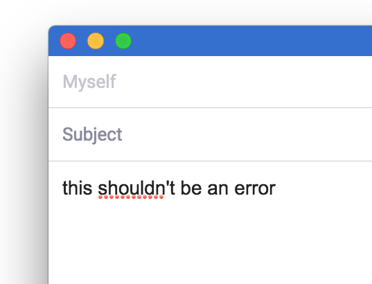

# electron-spell-check-provider

Electron's [spell-check API][setSpellCheckProvider] looks straightforward… until
you have to pull in and configure `node-spellchecker`:

```diff
webFrame.setSpellCheckProvider('en-US', true, {
spellCheck: function(text) {
+  return !(require('spellchecker').isMisspelled(text));
}
});
```

Which improperly flags contractions:



And only underlines misspelled words, leaving you to show suggestions [yourself][DIY context menu]…

Or you can use this module:

```js
webFrame.setSpellCheckProvider('en-US', true, new SpellCheckProvider('en-US'));
```

## Installation

```js
npm install electron-spell-check-provider --save
```

_Note:_ this uses a native module, so don't forget to
[rebuild your modules][rebuild] after installing.

## Usage

```js
// In the renderer process:
var webFrame = require('electron').webFrame;
var SpellCheckProvider = require('electron-spell-check-provider');

webFrame.setSpellCheckProvider('en-US', true, new SpellCheckProvider('en-US'));
```

'en-US' is the only supported language at present.

### But how do I show spelling suggestions (in the context menu)?

As the text selection changes, Electron will poll the spell-check provider.
If the current word is misspelled, the provider will emit a `'misspelling'` event
with spelling suggestions:

```js
webFrame.setSpellCheckProvider('en-US', true,
  new SpellCheckProvider('en-US').on('misspelling', function(suggestions) {
    console.log('The text at the site of the cursor is misspelled.',
      'Maybe the user meant to type:', suggestions);
  }
}));
```

If you save these suggestions, you can then show them in a [menu][menu] when the
`'contextmenu'` event next fires.

Here's a full implementation that uses
[`electron-editor-context-menu`][electron-editor-context-menu] to build the menu
for you in addition to handling some other gotchas:

```js
/**
 * Enables spell-checking and the right-click context menu in text editors.
 * Electron (`webFrame.setSpellCheckProvider`) only underlines misspelled words;
 * we must manage the menu ourselves.
 *
 * Run this in the renderer process.
 */
var remote = require('electron').remote;
var webFrame = require('electron').webFrame;
var SpellCheckProvider = require('electron-spell-check-provider');
var buildEditorContextMenu = require('electron-editor-context-menu');

var selection;
function resetSelection() {
  selection = {
    isMisspelled: false,
    spellingSuggestions: []
  };
}
resetSelection();

// Reset the selection when clicking around, before the spell-checker runs and the context menu shows.
window.addEventListener('mousedown', resetSelection);

// The spell-checker runs when the user clicks on text and before the 'contextmenu' event fires.
// Thus, we may retrieve spell-checking suggestions to put in the menu just before it shows.
webFrame.setSpellCheckProvider(
  'en-US',
  // Not sure what this parameter (`autoCorrectWord`) does: https://github.com/atom/electron/issues/4371
  // The documentation for `webFrame.setSpellCheckProvider` passes `true` so we do too.
  true,
  new SpellCheckProvider('en-US').on('misspelling', function(suggestions) {
    // Prime the context menu with spelling suggestions _if_ the user has selected text. Electron
    // may sometimes re-run the spell-check provider for an outdated selection e.g. if the user
    // right-clicks some misspelled text and then an image.
    if (window.getSelection().toString()) {
      selection.isMisspelled = true;
      // Take the first three suggestions if any.
      selection.spellingSuggestions = suggestions.slice(0, 3);
    }
  }));

window.addEventListener('contextmenu', function(e) {
  // Only show the context menu in text editors.
  if (!e.target.closest('textarea, input, [contenteditable="true"]')) return;

  var menu = buildEditorContextMenu(selection);

  // The 'contextmenu' event is emitted after 'selectionchange' has fired but possibly before the
  // visible selection has changed. Try to wait to show the menu until after that, otherwise the
  // visible selection will update after the menu dismisses and look weird.
  setTimeout(function() {
    menu.popup(remote.getCurrentWindow());
  }, 30);
});
```

## Contributing

We welcome pull requests! In particular, we'd love to see support for additional
languages.

Please lint your code.

## Copyright and License

Copyright 2016 Mixmax, Inc., licensed under the MIT License.

[setSpellCheckProvider]: https://github.com/atom/electron/blob/master/docs/api/web-frame.md#webframesetspellcheckproviderlanguage-autocorrectword-provider
[DIY context menu]: https://github.com/atom/electron/pull/942#issuecomment-136223543
[menu]: https://github.com/atom/electron/blob/master/docs/api/menu.md
[electron-editor-context-menu]: https://github.com/mixmaxhq/electron-editor-context-menu
[rebuild]: https://github.com/atom/electron/blob/master/docs/tutorial/using-native-node-modules.md#the-easy-way

## Release History

* 1.0.0 Initial release.

